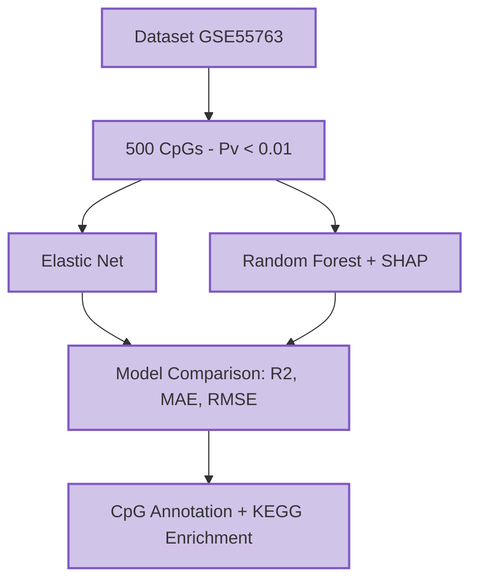

# Bioinformatics Capstone Project

This repository contains the final capstone project for the MSc in Bioinformatics at Northeastern University.  The goal of this project is to share its content, including scripts (R Markdown and Jupyter Notebooks), datasets, and results, to provide a reproducible and well-documented analysis methodology.  In addition, this project highlights hands-on applications of Bioinformatics and Computational Biology skills developed in the MSc program.

In this project, an epigenetic clock is constructed using DNA methylation data from GSE55763
Specifically, two predictive models are implemented: Elastic Net and Random Forest regressions which are used to predict age from high-dimensional CpG data, with SHAP analysis identifying the most influential CpGs for interpretability and biological insights. These CpGs are then annotated and analyzed for pathway enrichment using KEGG, providing biological context for the predictions.
The DNA methylation data used in this analysis was obtained from the Gene Expression Omnibus (GEO) under accession number GSE55763.
The following section presents the workflow implemented in this project:



## Learning Goals for the Course

- Gain experience in exploratory analysis, visualization, and statistical modeling of omics data.
- Critically analyze biological data using reproducible pipelines.
- Enhance the ability to present results clearly through visualizations, tables, and reports.
- Promote collaborative work in bioinformatics analyses.

# Technical Skills Inventory

## **Computational & Analytical Skills**

- **R**: R Notebooks (.Rmd) , scripts (.R)
- **Python**: Jupyter Notebooks (.ipynb), scripts (.py) 

**Statistics & Modeling**

- Descriptive statistics.
- Correlation analyses.
- Machine learning algorithms: ElasticNet, Random Forest.

**Bioinformatics Tools**

- Biological data analysis: Biopython, Bioconductor.
- Enrichment Tools: KEGG.

**Visualization & Reporting**

- R: ggplot2
- Python: matplotlib, seaborn

**Data manipulation**

- R: dplyr, tidyr.
- Python: pandas, NumPy

  
## Repository structure

**Scripts**


**Python**

- Scripts (.py)
- Jupyter notebooks (.ipynb)  


**R**

- Scripts (Rmd) and html 
  
  
**Data**

Stores raw and processed CSV files.

**Visualizations** 

Stores figures generated during analysis

**Dependencies**

**R**

**Install Bioconductor**

install.packages("BiocManager")
BiocManager::install()

**Install required CRAN packages**

install.packages(c(
  "ggplot2", "dplyr", "tidyr",  "tibble",  "KableExtra"
  "gridExtra", "factoextra", "FactoMineR", "glmnet", "blandr","randomForest","clusterProfiler","org.Hs.eg.db","enrichplot","patchwork","IlluminaHumanMethylation450kanno.ilmn12.hg19"
))

**Python**

pip install biopython pandas numpy matplotlib seaborn scikit-learn shap GEOparse


# HPC Environment / Setup

Run the following commands in your terminal to create and activate the conda environment:

```bash
# Create a new conda environment with Python 3.10
conda create -n geo_env python=3.10

# Activate the environment
conda activate geo_env
```

## References

- AkshajD. (2023). *Epigenetic-Clock*. GitHub repository. Available at: [https://github.com/AkshajD/Epigenetic-Clock](https://github.com/AkshajD/Epigenetic-Clock)
- [Bioconductor](https://bioconductor.org/) - An open-source repository for bioinformatics tools and packages in R.
- [Biopython](https://biopython.org/) - Open-source Python tools for analyzing biological data.
- Ching, Y. (n.d.). Gene-Expression-Analysis-of-Biguanide-Response-in-Glioblastoma. GitHub repository. Available at: [https://github.com/chingyaousf/Gene-Expression-Analysis-of-Biguanide-Response-in-GlioblastomaGBM_biguanide_analysis)
- Data to Viz. (n.d.). *From Data to Viz: A classification of chart types based on input data*. Retrieved from [https://www.data-to-viz.com/](https://www.data-to-viz.com/)
- Demh. (n.d.). demh GitHub repository. Available at:  [https://github.com/demh)
- Dozmorov, M. (n.d.). Mikhail Dozmorov GitHub repositories. GitHub repository. Available at: [https://github.com/mdozmorov)
- FoxoTech. (2023). *methylprep*. GitHub repository.  Available at: [https://github.com/FoxoTech/methylprep](https://github.com/FoxoTech/methylprep)
- [GEOparse](https://geoparse.readthedocs.io/en/latest/GEOparse.html) GEOparse documentation.
- [ggplot2 Documentation](https://ggplot2.tidyverse.org/) - A tool for data visualization in R.
- James, G., Witten, D., Hastie, T., & Tibshirani, R. (2013). An Introduction to Statistical Learning: with Applications in R. Springer. Available at: [https://www.statlearning.com)
- Lundberg, S. M., & Lee, S.-I. (n.d.). SHAP: A game theoretic approach to explain the output of any machine learning model. GitHub repository. Available at: [https://github.com/shap/shap)
- MarineGenomicsLab. (n.d.). *Marine Genomics Lab*. GitHub repository. Available at: [https://github.com/marinegenomicslab](https://github.com/marinegenomicslab)
- ModelOriented. (n.d.). shapviz. GitHub repository. Available at: [https://github.com/ModelOriented/shapviz)
- NBIS Epigenomics Workshop 2025: DNA Methylation Array Workflow. National Bioinformatics Infrastructure Sweden (NBIS). Available at: https://nbis-workshop- epigenomics.readthedocs.io/en/latest/content/tutorials/methylationArray/Array_Tutorial.html

## First Release
**Version:** 1.0  
**Date:** November 2025  


  
## Acknowledgements

**Author:** Magalí Eisik
